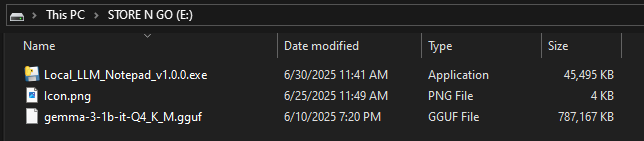
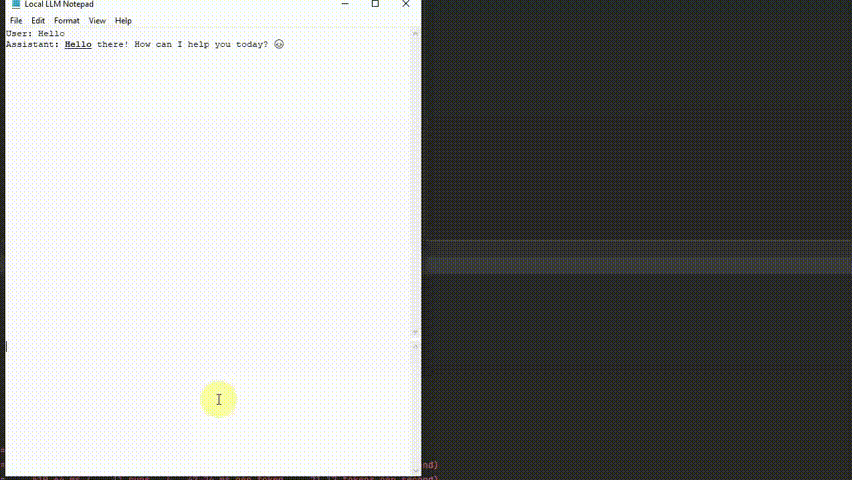
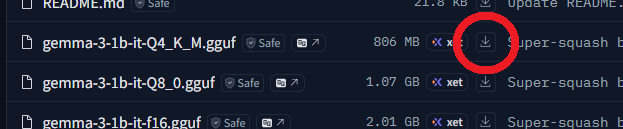
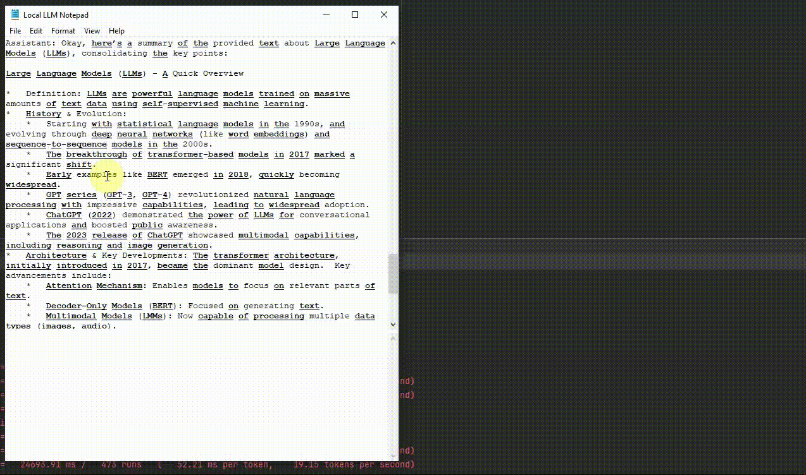
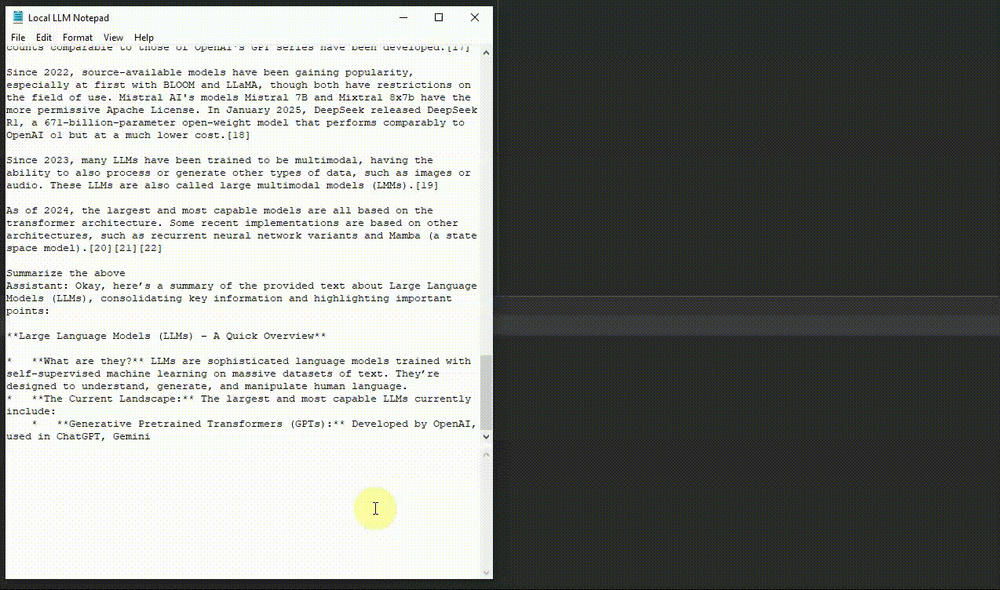
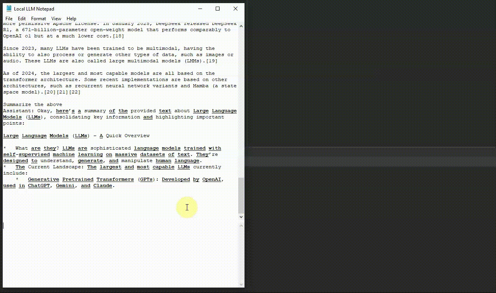
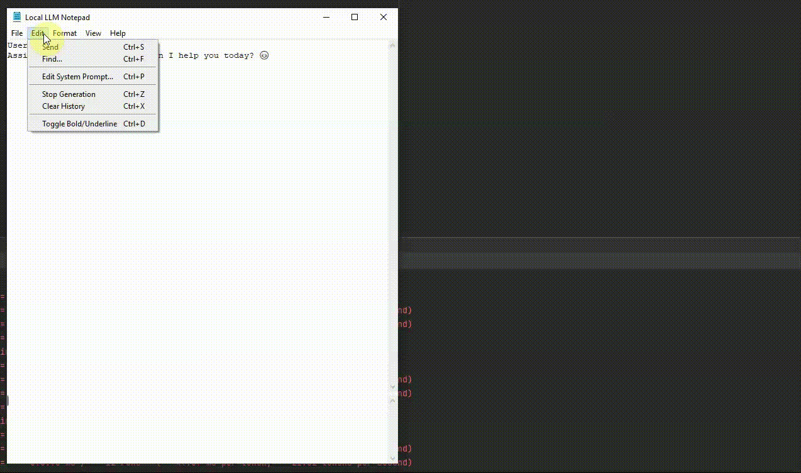
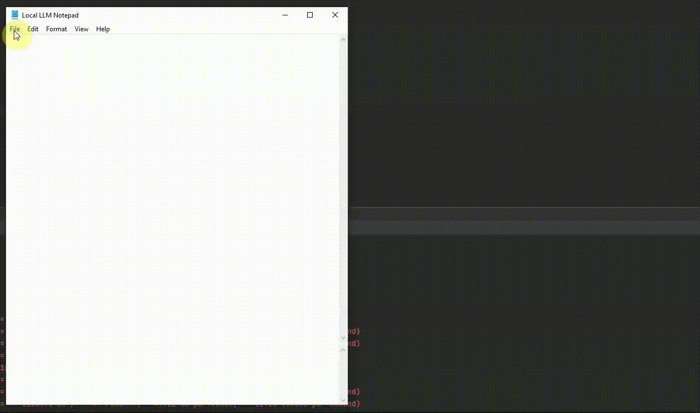

# Local LLM Notepad
Plug a USB drive and run a modern LLM on any PC **locally** with a double‑click. 

***No installation, no internet, no API, no Cloud computing, no GPU, no admin rights required.***

Local LLM Notepad is an open-source, offline plug-and-play app for running local large-language models. Drop the single bundled .exe onto a USB stick, walk up to any computer, and start chatting, brainstorming, or drafting documents. 







# Why you’ll love it

## 🔌 Portable

Drop the one‑file EXE and your .gguf model onto a flash drive; run on any Windows PC without admin rights.

## 🪶 Clean UI

Two‑pane layout: type prompts below, watch token‑streamed answers above—no extra chrome.

## 🔍 Source‑word under‑lining

Every word or number you wrote in your prompt is automatically bold‑underlined in the model’s reply. Ctrl+left click on them to view them in a separate window. Handy for fact‑checking summaries, tables, or data extractions.

## 💾 Save/Load chats

One‑click JSON export keeps conversations with the model portable alongside the EXE.

## ⚡ Llama.cpp inside

CPU‑only by default for max compatibility.

## 🎹 Hot‑keys

| Keyboard shortcuts | Action |
|------|------|
| `Shift` + `Enter` | send |
| `Ctrl` + `Z` | stop |
| `Ctrl` + `F` | find |
| `Ctrl` + `X` | clear chat history |
| `Ctrl` + `Mouse-Wheel` | zoom |


# Quick Start

Download `Local_LLM_Notepad-portable.exe` from the Releases page.

Copy the `.exe` and a compatible `.gguf` model (e.g. `gemma-3-1b-it-Q4_K_M.gguf`) onto your USB.

Double‑click the `.exe` on any Windows computer. First launch caches the model into RAM; subsequent prompts stream instantly.

Need another model? Use `File ▸ Select Model…` and point to a different `.gguf`.


# Download links:


| File | Link | Notes |
|------|------|-------|
| **Local_LLM_Notepad-portable.exe** | [Direct download (v1.0.1)](https://github.com/runzhouye/Local_LLM_Notepad/releases/tag/v1.0.1) | ~45 MB, contains everything needed to run LLM on Windows computer |
| **gemma-3-1b-it-Q4_K_M.gguf** | [Hugging Face](https://huggingface.co/ggml-org/gemma-3-1b-it-GGUF/tree/main) | Fast CPU model (~0.8 GB) we recommend for first-time users. Achieves ~20 tokens/second on an i7-10750H CPU  |
| **Icon (optional)** | [Notepad icon PNG](https://upload.wikimedia.org/wikipedia/commons/c/c9/Windows_Notepad_icon.png) | Save as `Icon.png` next to the EXE and it will be used automatically |


# Feature Details

### Portable One‑File Build


### Automated Source Highlighting (Ctrl + click)

Every word, number you used in the prompt is bold‑underlined in the LLM answer.  

Ctrl + click any under‑lined word to open a side window with every single prompt that contained it—great for tracing sources.



### Ctrl + S to Send text to LLM


### Ctrl + Z to stop LLM generation



### Ctrl + F to find in chat history



### Ctrl + X to clear chat history


### Ctrl + P to edit system prompt anytime



### File ▸ Save/Load chat history




# (Optional) Building your own portable `.exe`
The process is identical to the main repository:
`https://github.com/runzhouye/Local_LLM_Notepad` (only directory names and library versions in `requirements.txt` differ).

### 1. Clone repository
```bash
git clone https://github.com/yoken-do/local-llm-notepad.git
```
### 2. Go to the directory
```bash
cd local-llm-notepad.
```
### 3. Create environment
```bash
python -m venv .venv
```
### 4. Activate environment
```bash
.venv\Scripts\activate
```
### 5. Install dependecies
```bash
pip install -r requirements.txt
```

### 6. Go to `src` directory and run
```bash
cd src
main.py
```

### 7. Bundle everything (not work)
```bash
pyinstaller --onefile --noconsole --additional-hooks-dir=. main.py
```


# Known Issues
1. the project does not compile correctly or returns an error after compilation


